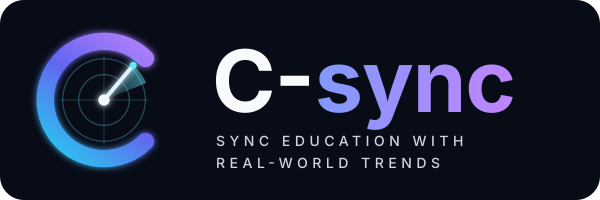

<p align="center">
  
</p>

# AI Trend Agent

AI Trend Agent turns technology signals from official RSS feeds and GitHub
releases into evidence-backed curriculum recommendations. It searches the
course material, verifies trends, scores their curriculum impact, and produces
an action plan with citations.

## Project structure

```text
01_data/
   curriculum/week_NN/      Course material (not in Git; see Setup)
   signals*.json            Saved monitoring signals
   demo_snapshot.json       The recorded run C-Sync shows
02_src/
   agents/                  Verification, curriculum, evaluation and recommendation agents, plus test_chain.py
   tests/                   test_verification.py
   schemas.py               Shared dataclass contracts
   curriculum_ingest.py     Extract and index PDF/PPTX/notebook content
   monitoring_github.py     Fetch GitHub releases
   monitoring_rss.py        Fetch official RSS posts
   clustering.py            Group signals into trend clusters
   demo_snapshot.py         Capture or replay a recorded run
03_assets/
   diagrams/                Project diagrams
   screenshots/             Project screenshots
04_eval/
   data/                    Gold-labelled datasets (test_signals_graded*.json)
   results/                 Saved evaluation runs
   run_eval.py, compare.py  Score a run against the gold labels; compare two runs
c_sync/                     C-Sync, the interface (Streamlit)
vectorstore/                Local generated Chroma database
```

## Setup

Use Python 3.10 or newer:

```powershell
python -m venv .venv
.venv\Scripts\Activate.ps1
pip install -r requirements.txt
Copy-Item .env.example .env
```

Set `GITHUB_TOKEN` in `.env` for the higher GitHub API rate limit and
`OPENAI_API_KEY` for live agent runs. Never commit `.env`.

Course slides are excluded from Git because of their size and redistribution
restrictions. Place downloaded PDF, PPTX, or notebook files in the matching
`01_data/curriculum/week_NN/` directory.

## Quickstart without an API key

Replay the committed run. This makes zero API calls:

```powershell
python 02_src/demo_snapshot.py --replay
```

For the full command list, observed outputs, offline checks, and troubleshooting,
see [02_src/agents/TESTING.md](02_src/agents/TESTING.md).

## Run the existing scripts

### Curriculum ingestion

```powershell
python 02_src/curriculum_ingest.py --curriculum 01_data/curriculum --db ./vectorstore
python 02_src/curriculum_ingest.py --db ./vectorstore --query "LangChain agents"
python 02_src/curriculum_ingest.py --db ./vectorstore --query "chunking" --week 2
```

The script also accepts `--week` to restrict a query and `-k` to set the
number of results.

### RSS monitoring

```powershell
python 02_src/monitoring_rss.py
python 02_src/monitoring_rss.py --days 60
python 02_src/monitoring_rss.py --secondary
python 02_src/monitoring_rss.py --check
```

### GitHub monitoring

```powershell
python 02_src/monitoring_github.py
python 02_src/monitoring_github.py --days 60
python 02_src/monitoring_github.py --repo langchain-ai/langchain
```

Repeat `--repo` to override the watched repository list.

### Clustering

```powershell
python 02_src/clustering.py --signals 01_data/signals.json
python 02_src/clustering.py --fetch --save 01_data/signals.json
python 02_src/clustering.py --signals 01_data/signals.json --check
```

Clustering also accepts `--threshold`, `--strip-prefix`, `--no-identifiers`,
`--max-freq`, `--frequencies`, `--min-shared`, and `--all`.

## C-Sync (the interface)

C-Sync is the project's interface. It reads a snapshot captured by
`demo_snapshot.py --capture` and makes zero API calls:

```powershell
python -m streamlit run c_sync/app.py
```

The left panel holds every page. The top bar holds only the five pipeline stages
(01 Discover, 02 Verify, 03 Compare, 04 Evaluate, 05 Decide), and each one opens
its page:

| Page | What it shows |
| --- | --- |
| Home | "From noise to curriculum": signals, clusters, assessed, recommendations and actionable, as squares sized by count |
| Dashboard | Every recommendation, most urgent first, with filters for action, lab/slides and actionable only |
| Radar | Each assessed trend as a light on a sweeping radar |
| Trend story | The original signal and the verification evidence, including repository stars and the release check |
| The gap | The trend beside the course material the curriculum agent matched |
| Evaluation | Maturity, relevance and overall score, revealed on request |
| Decision | The recommended action, its plan and the evidence chain |
| How it works | The five steps in plain language |

Every number comes from the recorded run, and no agent is re-run. Maturity is
`evaluation.py`'s own band for the stored confidence, and relevance is worked
back from the stored total. See [c_sync/README_UI.md](c_sync/README_UI.md).

Set `SNAPSHOT_PATH` to show a different capture:

```powershell
$env:SNAPSHOT_PATH = "01_data/experiment.json"
```

## Evaluation

```powershell
python 02_src/agents/test_chain.py          # offline test suite, zero API calls
python 02_src/tests/test_verification.py    # offline verifier tests
python 04_eval/run_eval.py --repeats 3 --out 04_eval/results/<name>.json
python 04_eval/compare.py <baseline.json> <after.json>
```

`run_eval.py` reads `04_eval/data/test_signals_graded.json` by default; pass
`--dataset` for another file.

## Generated files

`vectorstore/`, Python caches, virtual environments, logs, secrets, generated
run outputs, and course materials are excluded by `.gitignore`. Delete
`vectorstore/` to rebuild the local index from scratch.